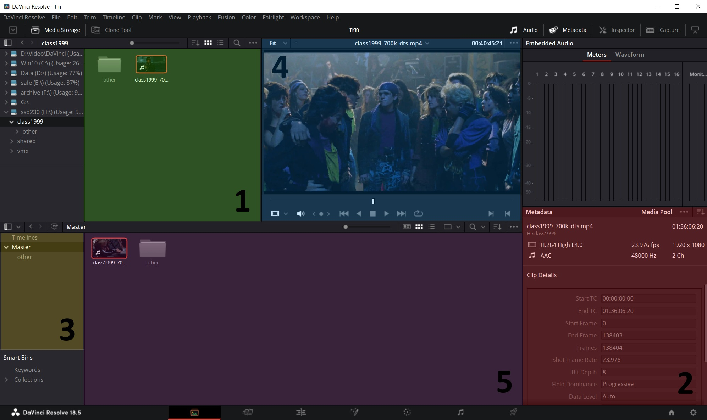

# Media

* 1 - в этой вкладке отображается содержимое папок, когда мы выбираем их в окне слева. Также в 1 можно перетащить файлы и папки из проводника напрямую. Это просто окно предпросмотра, такое перемещение никак не добавляет файлы в проект.
* 4 - если выбрать видеофайл, то в окне 4 можно будет его покрутить-посмотреть.
* 2 - в этом окне отображается разнообразная информация о выбранном видеофайле. Можно выбирать категорию информации, щелкнув кнопку со стрелкой в правом верхнем углу этого окна.
* 3 - чтобы файлы добавились в проект:
  * Нужно перетащить их в это окно в раздел Master. При этом сохраняется оригинальная структура папок.
  * Если же тащить напрямую в окно 5, то оригинальная структура теряется и все файлы появляются кучей.
* 5 - файлы, импортированные в проект. Если какой-то файл не нужен, удалять его нужно именно отсюда.