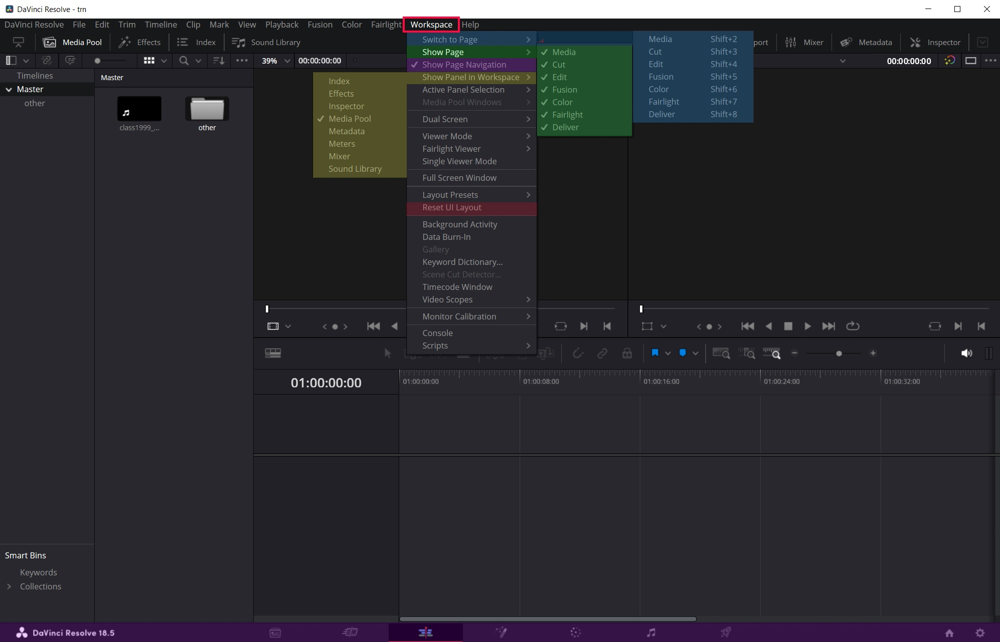

# Меню Workspace

* В этом меню можно включать \ отключать отображение разных окон.
* Есть пункт `Reset UI Layout`, если наскрывал больше чем хотелось и запутался.
* `Show page navigation` позволяет скрыть нижнее меню для высвобождения свободного места на экране.

# Тюнинг окна Editor

* 2 - кнопка Shrink позволяет сжать окно медиа-пула, чтобы окно таймлайна заняло всю доступную ширину экрана.
* 3 - кнопка Mixer открывает окно регулирования звуковой дорожки.
* 4 - кнопка Inspector открывает окно, позволяющее проводить различные трансформации с видео и аудио.