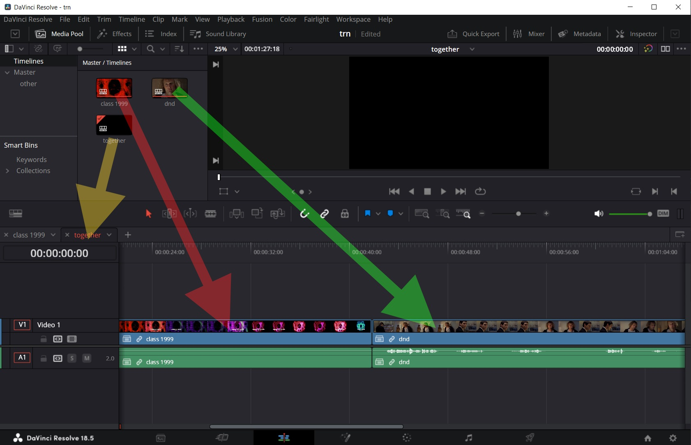
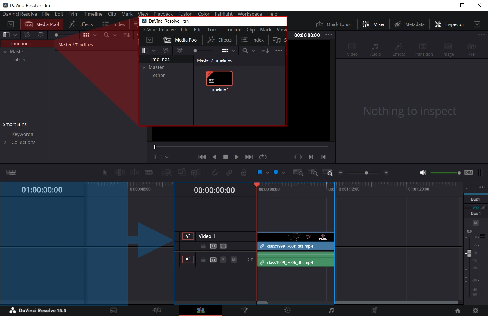
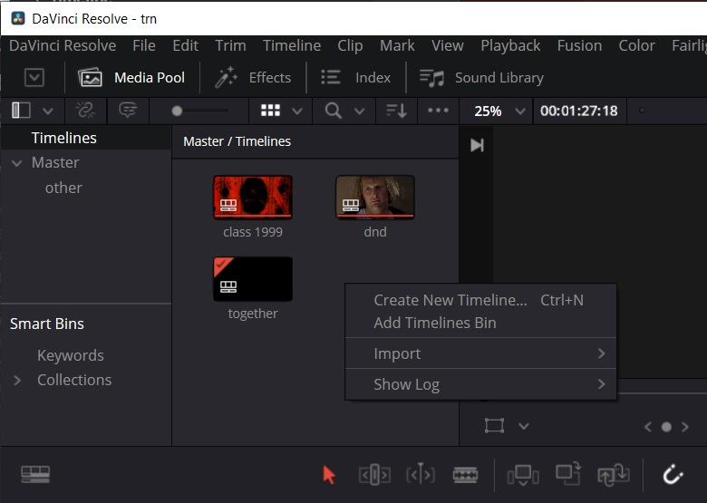
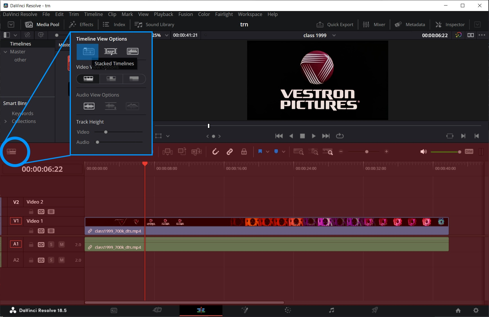
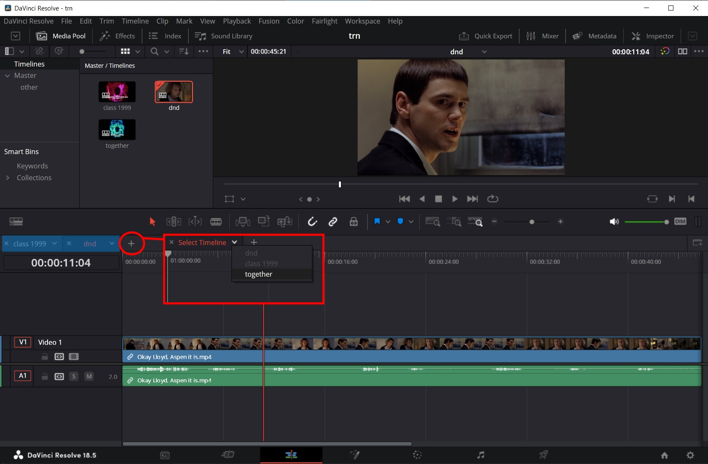
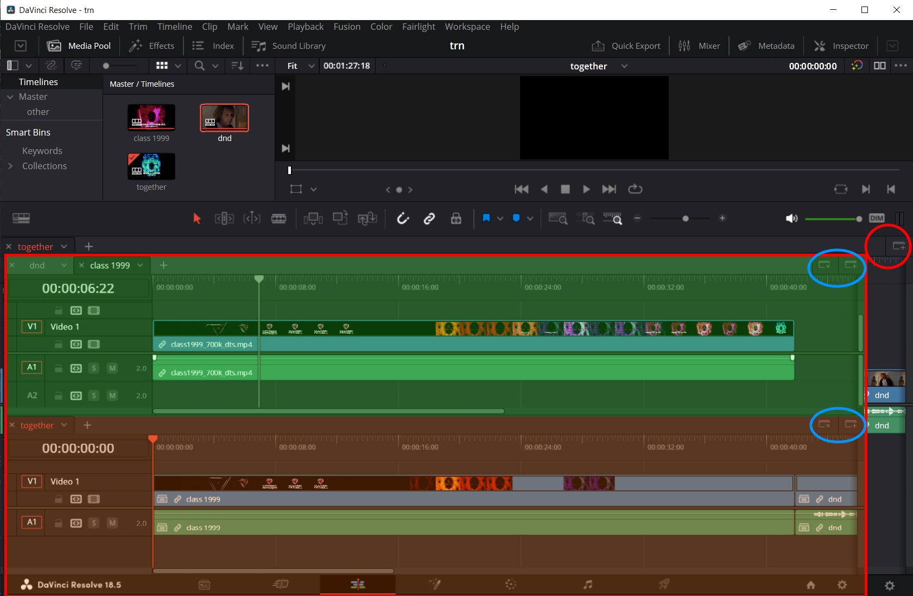
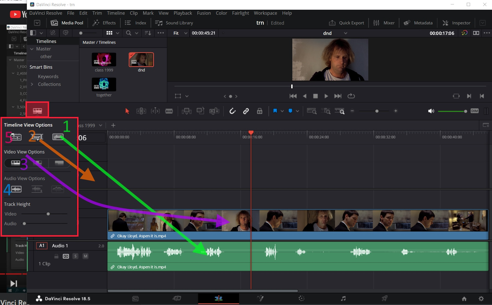
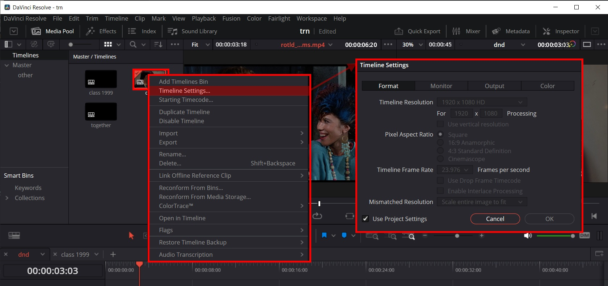

# Timeline

## Зачем нужен

Таймлайн можно воспринимать как контейнер внутри проекта. Допустим, если ролик состоит из нескольких сцен (вступление, знакомство, свадьба, семья), то можно каждую сцену оформить в виде отдельного таймлайна, а потом добавить еще один таймлайн и на него перебросить все эти сцены в нужном порядке как обычные клипы.

## Как создать

P.S. Чтобы появился раздел таймлайна, нужно включить его в меню `File > Project settings > General options > Color`, поставить галочку `Use timelines bin`. Странное расположение настройки и к тому же вероятно она доступна только при создании проекта. Но в крайнем случае можно просто создать в медиа пуле папку под таймлайны и руками складывать их туда.

* Таймлайн создается автоматически в разделе Media pool, во вкладке Timelines, если перетащить клип в окно редактирования, когда там еще вообще ничего нет.

* Можно создать таймлайн, если щелкнуть ПКМ в медиапуле в разделе таймлайнов и выбрать Create new timeline:

## Внешний вид

По умолчанию таймлайн выглядит так: в окне таймлайна мы видим только один таймлайн. Когда у нас их несколько, можно переключаться между ними, дважды щелкая по нужному в медиапуле. Кнопкой `Stacked timelines` можно включить отображение сразу нескольких таймлайнов в виде вкладок.

Для каждой вкладки из выпадающего списка можно выбрать таймлайн, который хотим в ней видеть. Можно создавать новые вкладки:

С помощью кнопки справа можно разбить единое окно с таймлайном на вертикальные окна, чтобы одновременно видеть несколько таймлайнов:

Таких вертикальных окон можно создавать сколько угодно. Закрыть их тоже можно кнопкой рядом.

## Остальные опции

Есть еще такие опции:

1. Включить \ выключить отображение звуковой волны.
2. Включить \ выключить отображение дорожек субтитров.
3. Переключить внешний вид видеодорожки: показывать каждый кадр, только первый и последний, вообще не показывать кадры.
4. Изменять высоту видео и аудиодорожек.
5. Включить Stacked-timeline стиль отображения таймлайнов (подробнее в конспекте "Базовый монтаж на таймлайне")

## Опции не визуальные

ПКМ по таймлайну в медиа пуле > Timeline Settings позволяет зайти в настройки таймлайна, которые относятся не к визуальному отображению, а к техническим параметрам:

