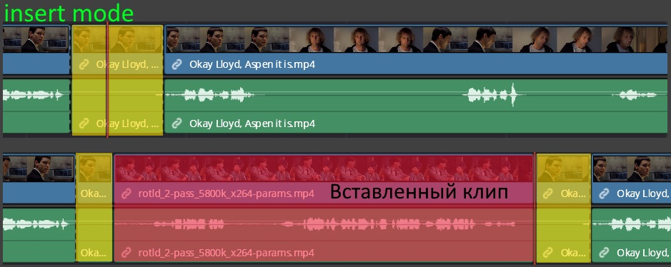
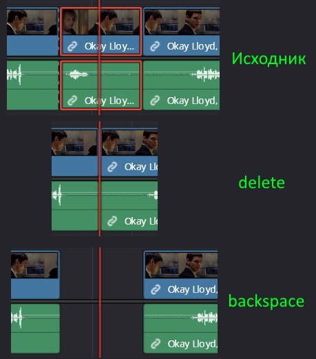

# TODO

* Написать самостоятельно про Trim, когда внутри клипа можно двигать контент. Чел про это не рассказал, но я помню что такая возможность есть и даже натыкался на нее пока проверял хоткеи.

# Базовый монтаж

## Добавление дорожек, активная дорожка

Чтобы добавить дорожку, щелкаем ПКМ на существующей дорожке и выбираем Add Track. В зависимости от того, на дорожке какого типа щелкнули, та и добавится. Нельзя удалить последнюю дорожку ни аудио, ни видео, поэтому у нас всегда будет "образец".

Можно задать дорожке имя. Активная дорожка выделена оранжевым прямоугольником.

## Перенос клипов на таймлайн

Клип можно перетащить на таймлайн напрямую, вручную разрезать границы, но есть более удобные способы:

1. Включаем Dual Viewer Mode, тогда у нас слева будет вьювер выбранного в пуле клипа, а справа - вьювер таймлайна.

2. Двойным щелчком выбираем в пуле клип, который хотим вставить на таймлайн. Он появится в левом вьювере.

3. Если хотим вставить не весь клип, а только его часть, тогда можем переместить ползунок в начало нужного фрагмента, нажать `I`, потом переместить ползунок в конец фрагмента и нажать `O`. Аналогично можно пометить не горячими клавишами, а кнопками, обозначенными на скриншоте цифрой 4. Чтобы сбросить маркеры начала и конца, нужно выбрать клип в медиапуле и нажать `Alt + X` или выбрать меню `Mark > Clear In and Out`. Можно удалять маркер начала и конца по-отдельности, сочетаниями `Alt + I` и `Alt + O`.

5. Способы перетащить:

   * Зажимаем на левом вьюпорте ЛКМ и тащим на правый вьюпорт. При этом появится оверлей со всеми возможными способами вставить клип.

   * Можно тащить не целиком за вьюпорт, а за кнопки, выделенные оранжевым, если нужно перетащить только видео или только аудио. 
   
   Клип вставляется на таймлайн относительно текущей позиции плейхеда (оранжевая вертикальная полоска) или плейхед просто определяет клип, а не позицию - зависит от режима добавления. Можно также добавлять кнопками, указанными в блоке 5.5, но там только три способа. 
   
   Возможные способы вставки:
   
   * `Insert` - новый клип врезается в позиции плейхеда в клип на *активной* дорожке, раздвигая его кусочки. Важно, что именно на активной, т.е. та у которой номер дорожки выделен оранжевым прямоугольником. 
   
     * Плейхед определяет позицию.
     * Ограничительные маркеры учитываются, т.е. если у нового клипа они установлены, то вставится клип не целиком, а только эта часть.
   
     
   
   * `Overwrite` - новый клип перезаписывает на активной дорожке все клипы согласно своей длине.
   
     * Плейхед определяет позицию.
     * Учитываются ограничительные маркеры нового клипа.
   
     
   
   * `Replace` - заменяет выбранным клипом тот клип на таймлайне, где стоит плейхед. Особенности:
   
     * Плейхед определяет заменяемый клип, а не место.
     * Ограничительные маркеры не учитываются. Замена происходит на новый клип целиком, даже если у него стоят ограничительные маркеры.
     * Структура таймлайна сохраняется:
       * Если новый клип длиннее, он не расширит таймлайн, а примет длину старого клипа.
       * Если новый клип короче, то на таймлайне останется часть старого.
   
     
   
   * `Fit to Fill` - замена с подгонкой длины нового клипа под длину старого путем модификации скорости воспроизведения.
   
     * Плейхед определяет заменяемый клип, а не позицию.
     * Структура таймлайна сохраняется:
       * Если новый клип короче старого, то скорость нового уменьшится.
       * Если новый длиннее старого - то новый ускорится.
   
   * :x:`Ripple Overwrite` - не понял как работает.
   
     * Структура таймлайна изменяется.
     * Плейхед определяет клип.
   
   * `Place on Top` - создает новую видео-, аудио дорожки и помещает новый клип на нее.
   
     * Плейхед определяет позицию вставки.
     * Ограничительные маркеры учитываются.
   
   * `Append at End` - добавляет клип сразу после последнего клипа на *активной* дорожке.

## Автовыбор дорожки для вставки

Эта кнопка определяет, в какую дорожку по умолчанию будет вставляться клип, вырезанный \ скопированный (`Ctrl + X`, `Ctrl + C`) из текущей дорожки. Поиск ведется от первой (1) аудио \ видеодорожки и до первой, где включен автовыбор.

В данном случае у нас две видеодорожки, на второй включен "Автовыбор", а на первой выключен. Поэтому когда мы вырежем фрагмент и вставим, то он окажется на второй, а не на первой (даже не смотря на то, что активна именно первая видеодорожка):

С аудио тот же принцип. Поиск будет вестись от самой первой дорожки до первой с включенным автовыбором. В данном случае всего одна аудиодорожка, поэтому в нее и вставляется.

# Удаление клипа

Удалить клип можно двумя кнопками:

* `Delete` - удаление со смещением таймлайна. Граничащие с удаленным клипы "схлопываются".
* `Backspace` - удаление без смещения таймлайна. Остается "дырка" после удаления.

# Горячие клавиши

TODO: надо здесь оставить только описание как открыть меню и как в нем ориентироваться. А конкретные хоткеи разнести по разделам действий. Т.е. раздел описывает действие, и указан хоткей.

Меню настройки хоткеев открывается через `Ctrl + Alt + K`.

В меню поиска можно искать команды по именам. Имена я писать не буду, выглядит муторно. Просто перечислю снизу полезные дефолтные хоткеи и по возможности раздел, где они лежат.

Чтобы хоткеи работали, язык должен стоять английский.

* Режим выбора элементов (Normal mode) - `A`

* Лезвие - `B` (`Application > Trim`)

  * Сделать быстрый разрез - `Ctrl + B`

  * Подрезать слева \ справа в месте плейхеда со сдвигом таймплайна - `Ctrl + Shift + [ ]`

    

  * Подрезать слева \ справа в месте плейхеда без сдвига таймлайна - `Shift + [ ]`

    

* Перемещение на один кадр

  * Плейхеда влево \ вправо - стрелки влево \ вправо

  * Клипа влево \ вправо - `,` и `.` (`Application > Trim > Nudge`, `One frame left \ right`)

    Если клип находится между других клипов, то перемещение происходит с подрезкой.

    

* Зуммирование (`Application > View`)

  * Приблизить \ отдалить (`Zoom > Zoom In \ Out`) - `Ctrl + + -`

  * Вместить весь таймлайн в экран (`Zoom > Zoom to Fit`) - `Shift + Z`

  * Вместить изображение целиком в окно вьювера (`Zoom viewer to fit`) - `Z`

    

* Воспроизведение

  * Воспроизвести \ Пауза - `Space` (`Application > Playback`)

# Зациклить фрагмент

Чтобы зациклить какой-то фрагмент, нужно:

1. Клавишами `I`, `O` поставить границы. Чтобы сбросить маркеры - `Alt + X`. Можно сбросить по-отдельности `Alt + I`, `Alt + O`.

   Маркеры можно ставить как на отдельном клипе, так и на таймлайне.

2. Нажать в интерфейсе кнопку `Loop`.

3. Запустить воспроизведение комбинацией `Alt + ?`. Эта комбинация начнет воспроизводить помеченный фрагмент независимо от того, где был плейхед. Одним словом, она ищет выделение и воспроизводит его. Без вжатой кнопки Loop воспроизведение остановится в конце фрагмента, а с вжатой - начнется опять с начала фрагмента.

Эта комбинация находится в разделе хоткеев `Application > Playback > Play around \ to`, называется `Play in to out`.